Academic Information 2022-23
======================

# El Hierro Research Trip

***El Hierro . UNESCO Biosphere Reserve . Canary Islands
March 27 - 31 2023***

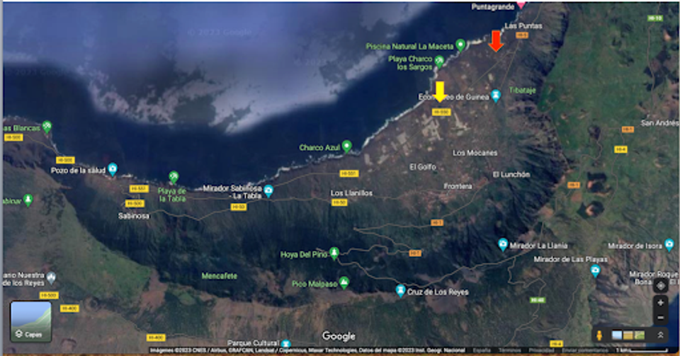

## Why el Hierro?

***Inclusive and regenerative innovation for distributed, resilient futures.***

Come join us for a week of research activities in a unique location that will offer us a diversity of opportunities to **experiment**, **learn** and **reflect** about ecosystemic regeneration and striving for resilience through **interdependent practices of knowing, intuition, material-driven experimentation, situational awareness and embodied research.**

### ****Goals and Methodology****

After taking the first steps in the MDEF methodology, we open a parenthesis in the masters’ program to connect to a very unique landscape and ecosystem in the Island of El Hierro to reflect and put into practice some of the ideas, topics and techniques we have shared during our first year of the course.

Through **exploratory visits**, **material experiments** and **reflection sessions**, participants will get the chance to learn profound techniques of working in-between living ecosystems in a unique island context where striving for resilience and respect for the environment has become paramount in the last couple of decades.

### ****Sneak peek into the program****

We will explore ecosystemic thinking, increasing personal presence, conscience and consciousness and how to nurture these connections with nature as co-client.

We will understand a slow and ancient wisdom alongside technological advancements.  We will delve into how to bring happiness to communities, building of sustainable co-operatives, empowerment, water, mobility, data, tourism, organic farming, carbon sequestration and housing. We will learn examples of creating a more resilient economy centred on happiness and resilience.

This workshop will offer a diversity of opportunities to Experiment, Learn and Reflect about yourself alongside ecosystemic regeneration and striving for resilience through interdependent practices of knowing, intuition, material-driven experimentation, situational awareness and embodied research.

In parallel to the discovery of the island, we will have dedicated time and space for some reflective sessions to give shape to our collective learnings and intelligence.

Through visits around the topics of energy production, sustainable agriculture, food production, ecological co-habitation and local architecture we will be discovering how el Hierro maintains and is developing new models of sustainability.

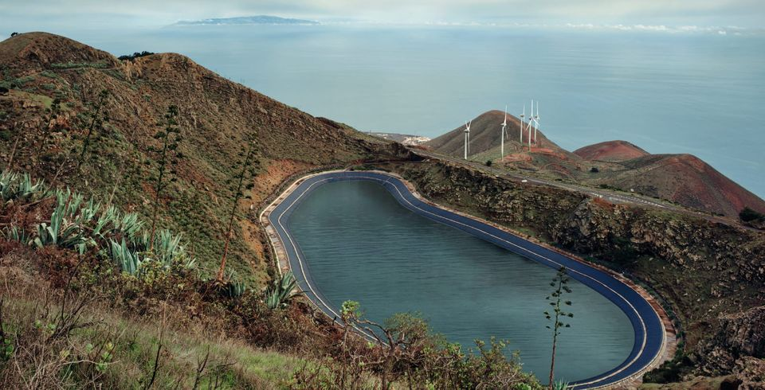

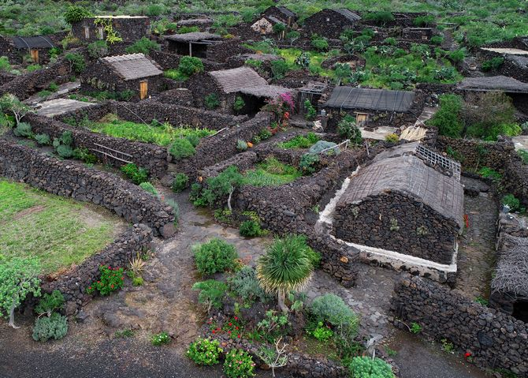

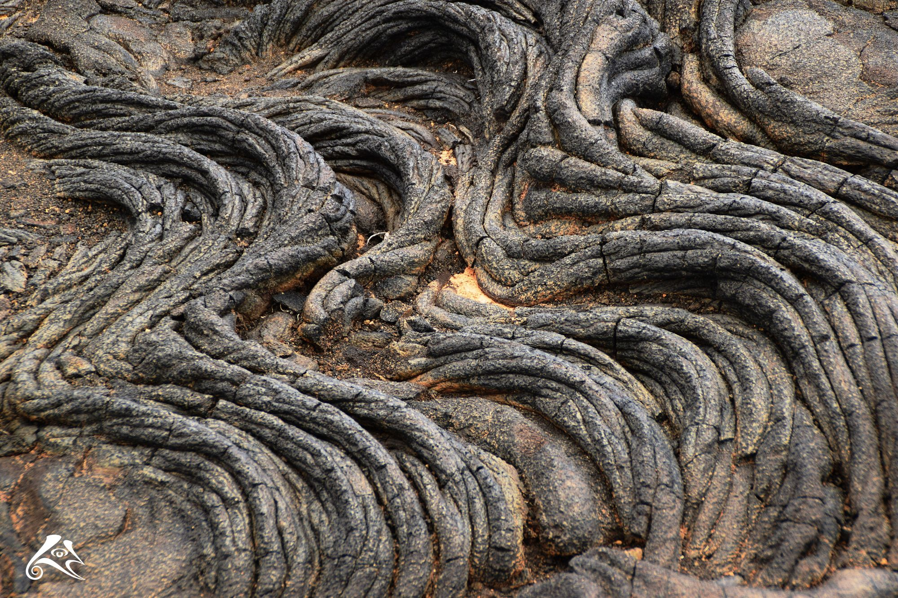

### Special Guest Faculty MDEF Research Trip 2023

#### Thomas Duggan - UK

*Biotechnology / craft / material science / material-driven research / architecture / design / advanced robotic fabrication / sculpture*

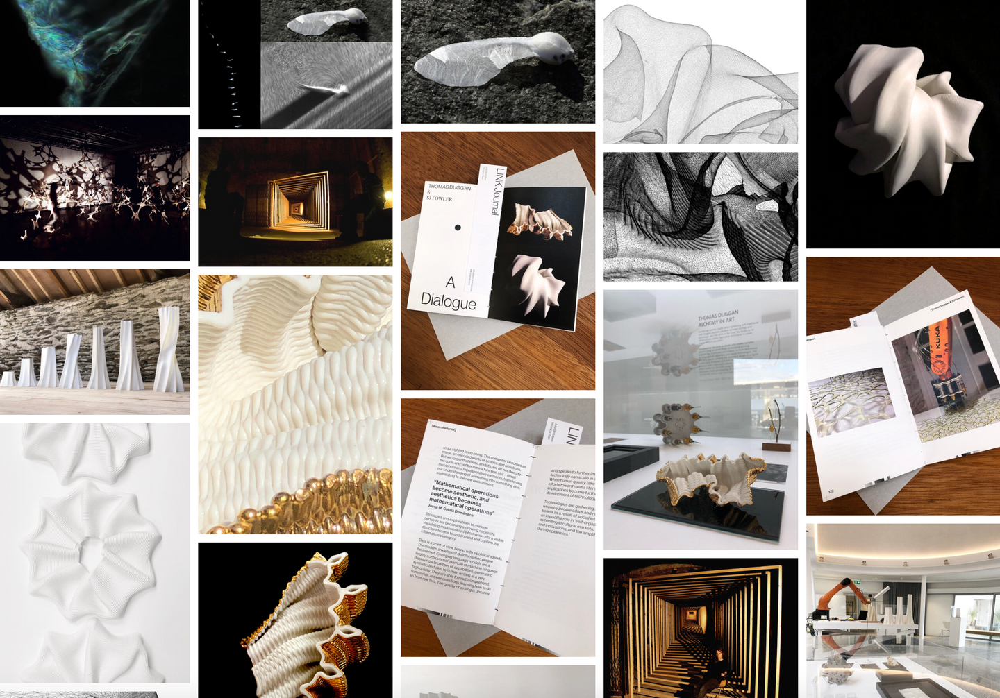

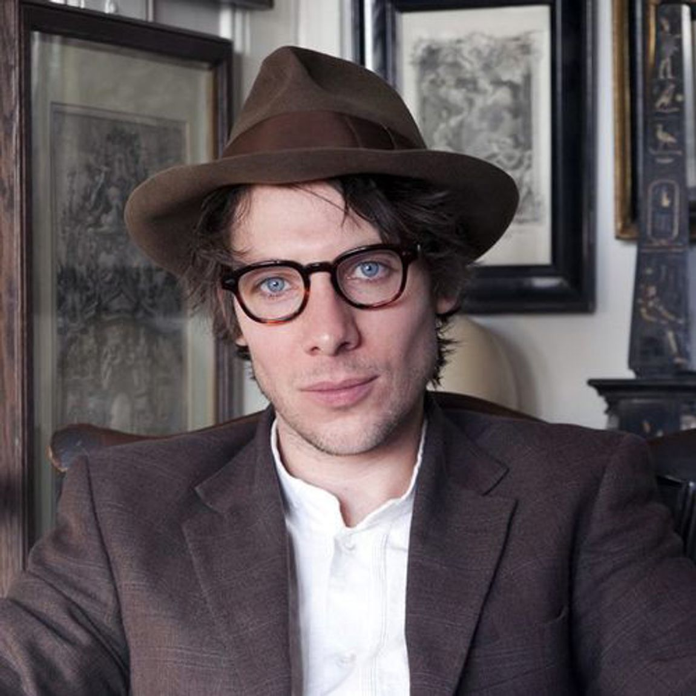

[www.thomasdugganstudio.com](http://www.thomasdugganstudio.com)

Thomas Duggan is an artist and also the director of Thomas Duggan Studio, a collaborative and multidisciplinary research studio.

Forwards-looking and future-assembling, Thomas’ work seeks to find new ways of 'languaging' and ‘presencing', to give voice to the more-than-human world. His practice is informed by a theoretical interest in bridging and hybridity between the human hand and the self-organising powers of nonhuman processes, creating works made from materials that are at the same time both ancient, advanced and have an intention to positively impact on things that matter.

Thomas has published work within leading scientific journals including Nature Nanotechnology, the Proceedings of the National Academy of Sciences of the United States of America as well as exhibiting at the V&A, Tate and MoMA. Thomas is guest lecturer and workshop facilitator at the Institute for Advanced Architecture of Catalonia (IAAC) and Lecturer in Craft and Material Practices at AUP.

Thomas co-created and co-facilitated the 2022 MDEF workshop in Mallorca.
✉ [thomasdugganstudio@gmail.com](mailto:thomasdugganstudio@gmail.com)

#### Audrey Belliot - Slow lab

*Low-Tech / Slow Movement / Rural Futures / Resilient Lifestyles / Self-Sufficiency / Food Futures*

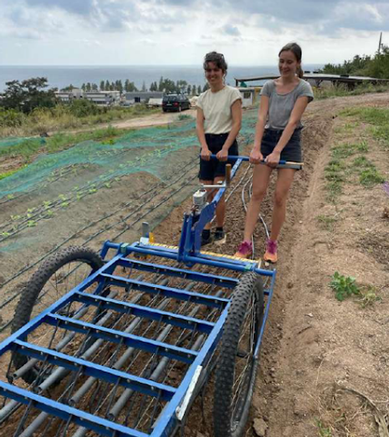

Ex-MDEFer, Audrey co-created Slow lab in January 2022. At the intersection between the slow movement and low-tech, Slow lab is a collective which wants to bring awareness and promote a resilient lifestyle. They organize social events and create artifacts to open conversations around how to integrate ancient techniques into our present context. Their practice questions and redesigns the tools we use in our daily life to become less dependent on high-technology.

#### Javier Morales - Island Host

*Environment / Sustainability / Agriculture / Energy / Self-Sufficiency*

Part of the local and regional government in the areas of Agriculture, Environment, Primary Sector and Economic, Business Planning, and Sustainability.

## Trip logistics

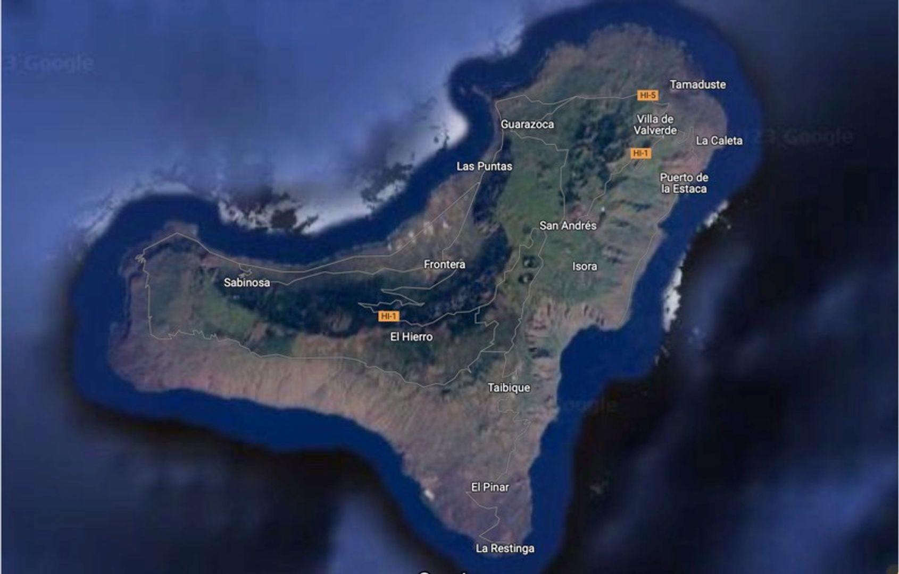

The airport is close to La Caleta (north-east of the island).
We will stay and work in the Frontera area.

#### **Workspace**

(Yellow arrow)

A Banana greenhouse converted into a workspace.

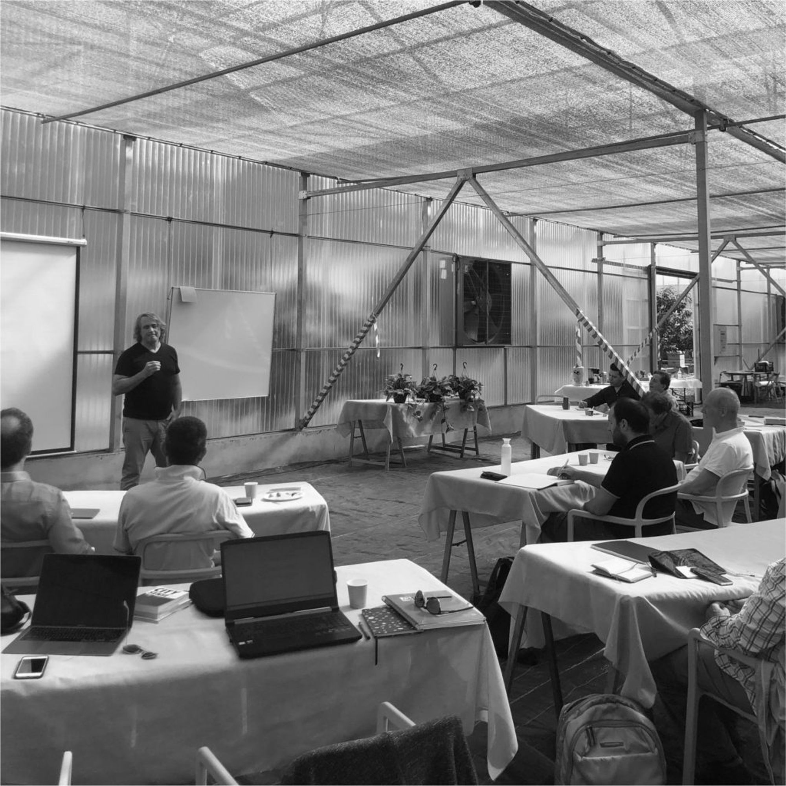

The workspace will be available for us the entire week, to work, experiment, reflect and share with the group.

#### **Stay and Accommodation**

(Red arrow)

## **[Apartamentos Finca Wapa](https://www.booking.com/hotel/es/finca-wapa.es.html?aid=311090&label=finca-wapa-Ps5h0bABevkbMmpjFN9HIQS338554039616%3Apl%3Ata%3Ap1%3Ap2%3Aac%3Aap%3Aneg%3Afi%3Atikwd-325506953000%3Alp1005433%3Ali%3Adec%3Adm%3Appccp%3DUmFuZG9tSVYkc2RlIyh9YcGt_tphEo8pawEozW2KQ80&sid=dc1221be836197af4e807af436d31bcf&dest_id=-383046;dest_type=city;dist=0;group_adults=2;group_children=0;hapos=1;hpos=1;no_rooms=1;req_adults=2;req_children=0;room1=A%2CA;sb_price_type=total;sr_order=popularity;srepoch=1674831191;srpvid=3ccb68ab464e0278;type=total;ucfs=1&#hotelTmpl)**

Calle El Matorral, 33 , 38911 La Frontera, España

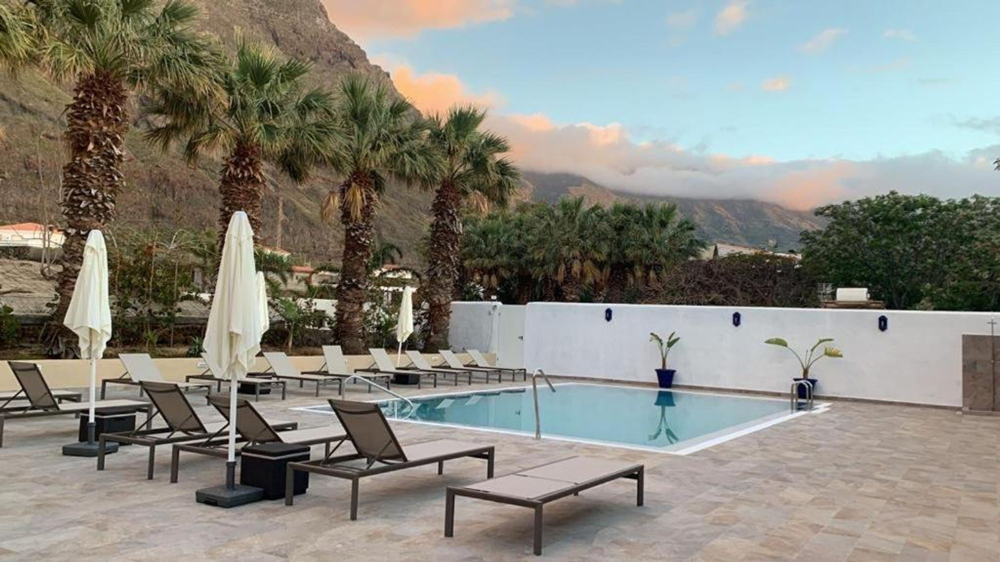

[Here](https://docs.google.com/spreadsheets/d/1TfHMG0q-AwP1t-G_YpQ5Kj1Vca7aamxB_CHCgxX5bY4/edit?usp=sharing) you can find the description of the apartments and the prices.

(The average price per night per person is 32 Euros).

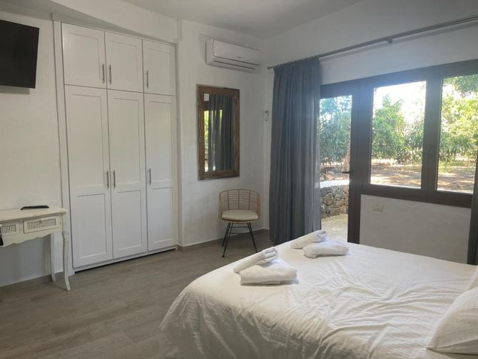

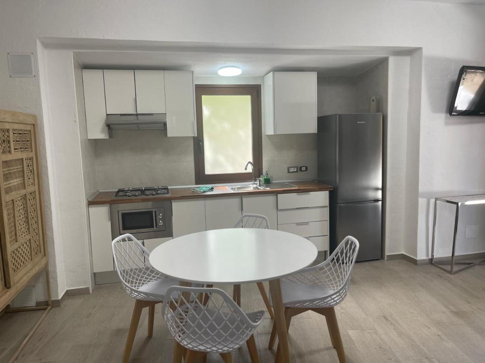

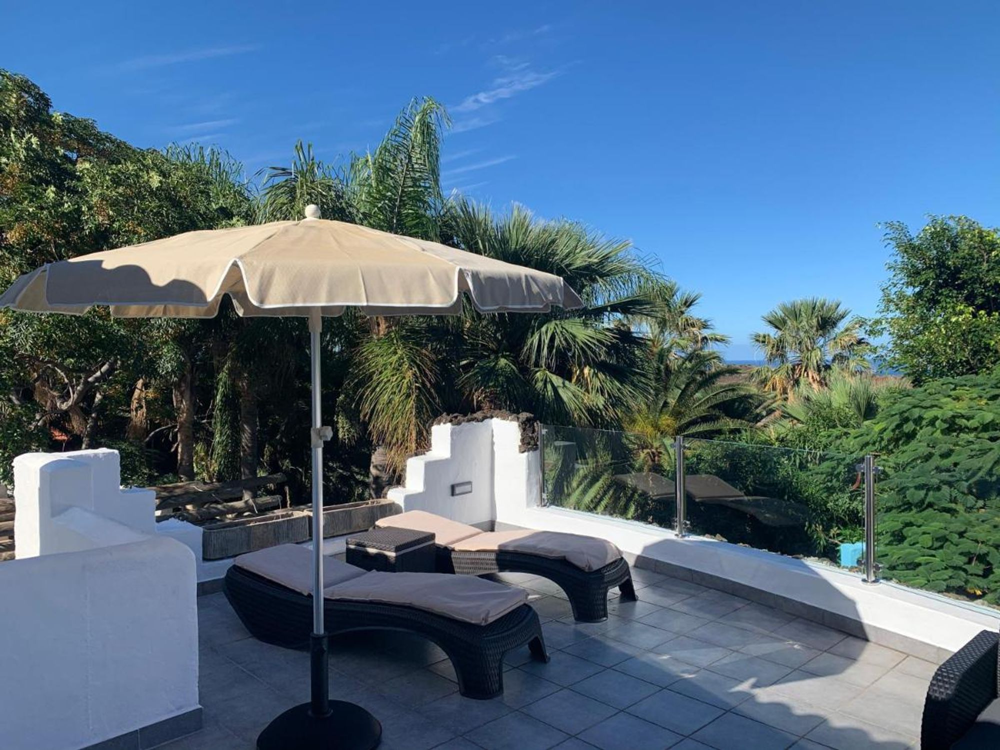

####  **Transportation**

**Car rental** with [Cicar](https://www.cicar.com/).
The master will take care of renting the cars. The number of cars to rent depends on the number of participants.

## References

####  **Articles**
[Heroes of El Hierro, Part I. A Regenerative Economy in Action.](https://medium.com/age-of-awareness/heroes-of-el-hierro-part-i-e6e45fa6ee85)

[Heroes of El Hierro, Part II. A Regenerative Economy in Action.](https://medium.com/age-of-awareness/heroes-of-el-hierro-part-ii-f5a25937a21b)

[Islands as case studies for bioregional regeneration](https://medium.com/age-of-awareness/islands-as-case-studies-for-bioregional-regeneration-72be46bb0734)

####  **Movies**

- [Fire of Love](https://www.youtube.com/watch?v=-_7XADmKVL0)

## Trip impact . Useful resources

As any other trip, we need to take into account the environmental impact of traveling to El Hierro.
Different transportation modes are possible to reach it.

⛵ **Sailing**
The least impact. But also the most difficult to plan!
It should be around a 4 days trip to sail from Gibraltar to the Canary Islands.

⛴ **Taking a ferry**

*Resource to calculate your impact:* [https://bonpote.com/ferry-calculer-en-1-minute-son-empreinte-carbone/](https://bonpote.com/ferry-calculer-en-1-minute-son-empreinte-carbone/)

**✈ Flying**

********************Resource to calculate your impact: [https://bonpote.com/en/flight-calculate-your-carbon-footprint-in-3-clicks/](https://bonpote.com/en/flight-calculate-your-carbon-footprint-in-3-clicks/)*

**Hybrid options**

- Train + flight
- Train + ferry : example, BCN-Sevilla-Cadiz (train 10h) + Cadiz-Santa Cruz de Tenerife (ferry 39h) + to Los Crisitanos (bus 1h) + to Valverde (ferry 2h30)
