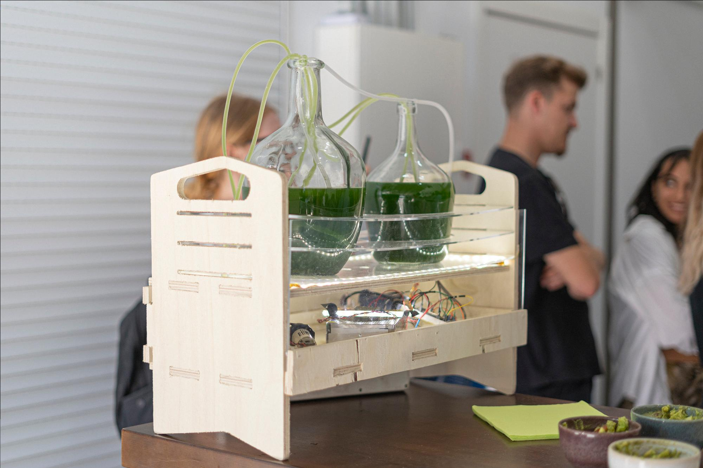
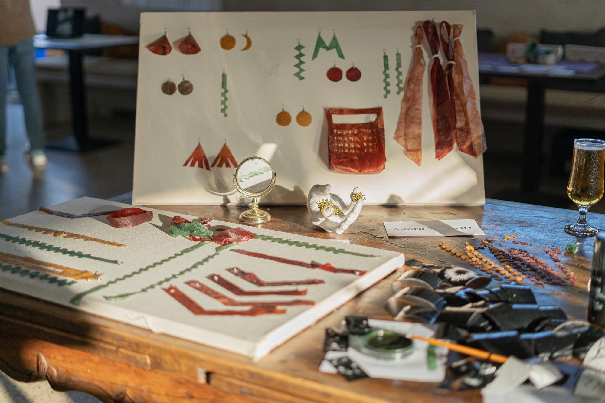
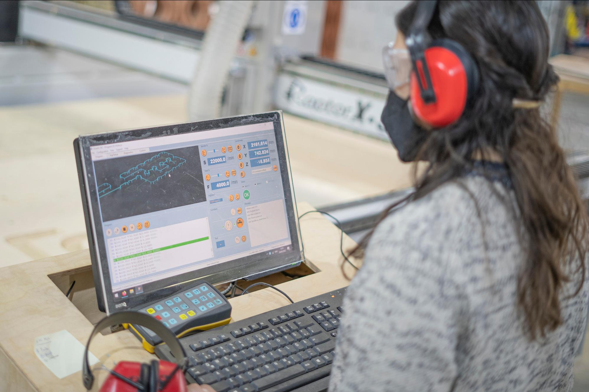

Structure of 2022-23
======================
# Digital Prototyping For Design

## Track
Application

## Faculty

Victor Barberán Soler, Santiago Fuentemilla, Eduardo Chamorro, Josep Martí, Óscar González and Petra Garajova

## Syllabus

Advanced manufacturing, rapid prototyping and new design methodologies are not only changing how we work, live and play but reshaping the processes and interactions in the cities and sociecities. The introduction of those processes into the design and industry fields are changing the paradigm on how we conceive the actual society and its production methods. This new mediation between the old knowledge and new techniques is making the process as important as the end work, all becoming a whole.

During this 2 term course (2&3), students learn how to envision, prototype and document their projects and ideas through many hours of hands-on experience with digital fabrication tools, taking a variety of code formats and turning them into physical objects. The program provides advanced digital fabrication instruction for students through an unique, hands-on curriculum and access to technological tools and resources.

## Weekly Schedule

### Master Classes:
This classes are given every two weeks on Wednesday and Thursdays from 10 Am to 13.00 Pm (CET time) for two weeks in a row.

### Lab life:
In addition to the lectures, there are 2 lab days each week where students have access the digital fabrication equipment and personal help with projects.Fabrication time through booking system,this happens every Tuesday and Friday

### Challenge week:
Intensive timeframe for a week (Tuesday to Friday) where students will combine the knowledge gained in the previous classes.

## Learning Objectives

**The goal of DIGITAL PROTOTYPING FOR DESIGN** is to combine the concepts and practices of digital fabrication & prototyping electronices with the objectives of the MDEF course in a meaningful way to develop student research projects.

A core aim is to empower students with hands-on prototyping in the Fab Lab environment, unlocking technological ‘black boxes’ to create a deeper understanding of technology in designing for emergent futures.

## Structure and Phase

!!! note
  The following timetable is provisional and may undergo modifications and adaptations during the course.

### 1 Block of Master classes

* 01/02/23		- Basic electronics & Coding
* 02/02/23		- 2D Design tools (parametric design)
* 08/02/23		- 2D Fabrication (Laser, vinyl)
* 09/02/23		- Inputs / Outputs
* 14/02/23		- **First Challenge** (Intellectual property)

### 2 Block of Master classes

* 08/03/23		- Networking
* 09/03/23		- 3D Scanning - 3D softwares
* 15/03/23		- Interfaces and machine interactions
* 16/03/23		- CNC
* 21/03/23		- **Second Challenge** (Intellectual property)

### 3 Block of Master classes

* 26/04/23		- TBD - Advance Design
* 27/04/23		- Interfaces
* 03/05/23		- Wildcard week
* 04/05/23		- TBD - Coding
* 21/03/23		- **Final Challenge** (Intellectual property)

## Methodology

The program apply Fab Academy mindset and set of skills, but applying new methodologies such as **"challenges"**, redistributing the impact of weekly hours and adding new assessment criteria.

The instructional design of the course has two fundamental assumptions, individual reflection tasks for each weekly topic, and monthly intensive maker-sprint in the form of **“micro-challenges”**. Students work in small groups to develop week-long projects applying knowledge and skills from the previous Fab Academy topics with concepts related to MDEF and their research projects, aimed to bridge the gap that has existed between these two courses and demonstrating the competencies acquired.

The challenges combine four weekly cycles into one intense project-based fabrication sprint. Therefore, the objective is to combine the skills and knowledge acquired throughout the weeks prior to the challenge in order to ideate a small project that is connected to their personal interests and individual or collective interventions. The students have to use the technology and equipment available and focus on the specific skills they have already acquired during the past weeks. This is set as a primary goal to foster the students’ capacity to design and conceptualize their projects with the tools and skills they might have available, without limiting the possibilities of what they could achieve. In addition, the challenges align with the MDEF design studio in an effort to connect each challenge topic to the current status of the design interventions of the students. As mentioned before, the intention is to weave the two courses together in order to enhance both for the benefit of the students’ projects. The design studio provides a critical context in relation to the technologies developed during Fab Academy, and in return the Fab Academy course yields the skills and knowledge to help physicalize these concepts.

## Materials Needs

All materials needed for the course will be provided by the faculty. The students are required to bring to the classes their own students toolkit and the programming boards given to them at the start of the academic year, other development boards, sensors and actuators will be provided during the classes. Bring in your laptop with the proper software installed prior to the class if required (emails will be sent prior to the classes regarding this aspect).

## Output

Each student builds a portfolio on their respective websites that documents their mastery of different certificates taken individually along each week and their integration into a final, larger project, related to their masters thesis development.

 **The DESIGN FOR PROTOTYPING COURSE is PASSED by growth progress rather than a global goal, for successful completion of each weekly assignment and challenge is a must.**

 

## Grading Method

-  **Only the documentation into their webpages will be taken in account for evaluation**
- The weekly standards and grading will be presented during the weekly master classes.
- Prototyping process understanding ,workflows and evolving best practices will seriously be taken in account.

### Academic level - 40%

*Level of the project, artefacts or activities (quality and complexity of the solutions/ reflections/prototype/code/artifacts)*

- Initial idea / Concept of the Project ( aligned to research areas)
- Propose (What is supposed to do or not to do)
- Shown how your team planned and executed the project. (Explain personal contributions)
- Integrated Design (How you designed it - relation between elements)
- Honest Design (use of technology in a meaningful way, in relation to the topics)
- Explore design boundaries (based on your expertise)

### Open Content- 35%

*Level of clarity and detail of the documentation material (photos, video, text, etc)*

- Design process (How did you iterate)
- How did you fabricate it (fabrication processes)
- System diagram (illustration explaining function, parts, and relations)
- Design & Fabrication files (open source or open format)
- BOM (Build of Materials)
- Reflect about future development opportunity
- Described problems and how the team solved them
- Photograph's of the end artefacts
- Add names and links to your individual pages

### Attitude - 20%

*Involvement, Motivation level, proactive behaviours*

- Attendance to classes
- Proactive behaviours to find answers during the program
- Help others student’s projects
- Participation in feedbacks sessions

### Explosion - 5 %

Bonus if your artefact doesn´t explode and actually works as expected

## Links
[Hackmd Page For More Information](https://hackmd.io/@fablabbcn/HJVq7KE_s/edit)

<iframe src="https://drive.google.com/embeddedfolderview?id=1ChV9K7ZzacBq-3z7ZDxCqPcpuaFwOoG8" style="width:100%; height:100%; border:0;"></iframe>

[Open Drive folder](https://drive.google.com/drive/folders/1ChV9K7ZzacBq-3z7ZDxCqPcpuaFwOoG8){ .md-button .md-button--primary }
